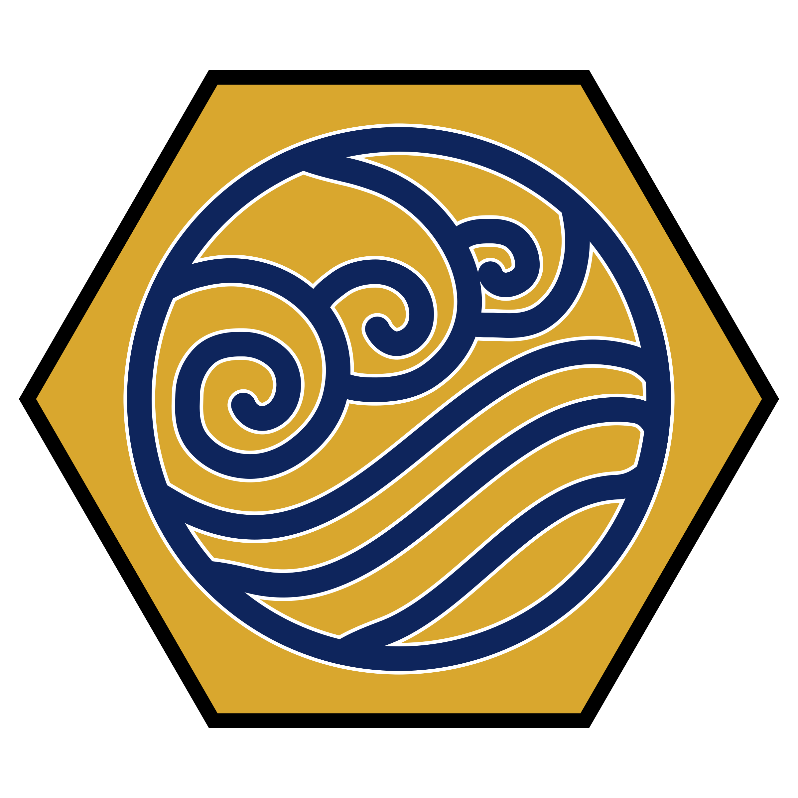
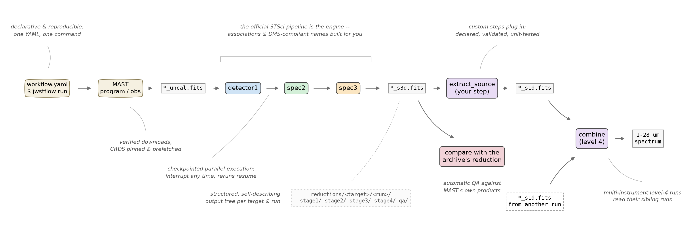

<h1 align="center">jwstflow</h1>

<p align="center">
  <a href="https://github.com/spacetelescope/jwst"></a>
  
  
  
</p>

<p align="center"><b>Reproducible JWST reductions from one YAML file and one command.</b><br>
jwstflow (pronounced <i>"justflow"</i>) orchestrates the official STScI <a href="https://github.com/spacetelescope/jwst"><code>jwst</code></a>
calibration pipeline and automates everything around it: data, references, execution, provenance.</p>



You describe your reduction in one YAML file; the target, where its data
comes from, and the pipeline stages with their parameters, and jwstflow
does the rest for you. It downloads and verifies your data from MAST, pins
and prefetches the CRDS references, builds the associations, and runs the
official pipeline stages in parallel with checkpoints: interrupt and resume at any time. 
Your products get DMS-compliant names and land in a clean per-target, per-run tree, together
with QA figures. When the official steps are not enough, your own
science steps plug in through a small, validated contract and run like any
other stage. You get reductions you can rerun, hand to a collaborator, and
defend, with every calibration decision one visible line of YAML.

<br clear="left">

What a reduction looks like, in one (simplified) picture:

<p align="center">
  <a href="docs/overview_dag.png"></a>
</p>

Every run starts by drawing its own version of this figure, with the
actual inputs, steps and products of your YAML, into `qa/workflow_graph/`,
so you can inspect what a workflow does before and after it runs.

## Installation

```bash
uv pip install git+https://github.com/lwelzel/jwstflow   # core: jwstflow + the official jwst pipeline
```
Contributed step packages are separate distributions that register their steps
with jwstflow on install -- add the ones you have access to:
```bash
uv pip install jwstflow-midas                                  # public contributed steps
uv pip install git+ssh://git@github.com/<org>/jwstflow-joys    # proprietary, e.g. JOYS+
```
Your reductions live in a project repository of their own that depends on
jwstflow (see [docs/guide.md](docs/guide.md), "Projects, targets, runs").

Put your credentials in the project root (they are found automatically):
`.env.crds` with `CRDS_PATH=...`, and `CRDS_SERVER_URL=...`, as well as `.env.mast` with `MAST_API_TOKEN=...`
(optional for public data). 
`uv run jwstflow --help` shows every command.

## Usage

### One command per reduction

```bash
uv run jwstflow run reductions/eso-ha-569/nirspec_ifu.yaml # from inside your reduction project repo
```

A run downloads what it needs, syncs CRDS, executes the stages in parallel
with checkpointing, and can be interrupted and rerun at any time -- finished
work is never repeated. A **workflow YAML** names a `target` and a `run`,
optionally a `download:` block (program/observations/instrument), and a list
of `stages:`, each an official pipeline (`detector1`, `spec2`, `spec3`, ...)
or a custom step, with its inputs and parameters:

```yaml
target: ESO-Ha 569
run: nirspec_ifu
download: {program: 1751, observations: [6], instrument: NIRSPEC, modes: [IFU], products: [UNCAL]}
stages:
  - step: detector1
    inputs: [{stage: raw, pattern: "*_uncal.fits"}]
  - step: spec2
    inputs: [{stage: calwebb_detector1, pattern: "*_rate.fits"}]
    parameters: {steps: {clean_flicker_noise: {skip: false, fit_method: fft}}}
  - step: spec3
    inputs: [{stage: calwebb_spec2, pattern: "*_cal.fits"}]
    association: {mode: group, level: 3, group_by: [PROGRAM, OBSERVTN, GRATING, FILTER]}
```

Outputs land in `reductions/<target>/<run>/` split by calibration level
(`stage1/ ... stage4/`, `qa/`), raw data is shared per target, and stage
names come from the steps themselves so every run looks the same everywhere.
Start from a preset (`extends: preset:nirspec_ifu`; also `nirspec_mos`,
`miri_mrs`, `miri_imaging`) and override only what your data needs.

### The rest of the interface

| command | purpose |
|---|---|
| `validate <wf> [--resolve]` | check the YAML, env files, CRDS/MAST setup and (with `--resolve`) that every step imports |
| `plan <wf>` | show every task that would run, and what is cached, without running |
| `run <wf> [--only/--from/--until STAGE] [--task GLOB] [--force] [--set key=value]` | run all or part of the workflow |
| `status <wf>` | per-stage table of done/failed/pending tasks |
| `prefetch <wf>` | do all network work (data, CRDS, reference products) without running stages |
| `graph <wf> [-o DIR] [--format svg,pdf]` | render the workflow DAG (data patterns -> steps -> products); also drawn automatically into `qa/workflow_graph/` at every run start |
| `clean <wf> [--stage S] [--orphans]` | delete outputs / stray files so stages rerun |
| `debug-task <wf> <task-id>` | rerun one task in-process (drop into `pdb` on failure) |
| `steps [--describe NAME]` | list every available step: official, contributed, plugins |
| `check-step SPEC` / `new-step Name` | audit a custom step against the contract / scaffold one with a test |
| `new-package NAME [--steps a,b] [--private]` | scaffold a whole contributed package: entry points, stubs, tests, README, git |
| `init [preset]` | write a starter workflow |

Everything is also a Python API (`load_config`, `Runner`); see
[docs/guide.md](docs/guide.md) for the run model, naming rules, the full YAML
reference, associations, checkpointing and parallelism.

## Custom steps

Any part of a reduction can be replaced or extended: subclass an official
pipeline to change its behaviour (it keeps its stage identity), or write a
new step -- a small class declaring what it consumes and produces, with typed
parameters and a `run()` method:

```python
class ExtractExtended(Step):
    """Sum an extended source over an aperture mask."""
    level, inputs, outputs = 4, ("*_s3d.fits",), ("s1d",)
    class Params(StepParams):
        threshold: float = Field(0.05, gt=0)
    def run(self, inputs, ctx, *, threshold=0.05, **params):
        out = ctx.derived_path(inputs[0], "s1d", descriptor="extended")
        ...
        return [out]
```

jwstflow validates the declaration at import, the parameters at config load,
and the outputs after every run (custom steps can never masquerade as
official products); `jwstflow new-step` scaffolds a step with a passing test
and `jwstflow.testing` runs steps on synthetic data without CRDS or real

## Citing

There is no jwstflow publication yet. If jwstflow contributed to your
research, please acknowledge it, e.g.:

> This work made use of jwstflow (L. Welzel), an orchestrator for the JWST
> calibration pipeline, and of the `jwst` calibration software (Bushouse et
> al.) and CRDS provided by STScI.

and cite the [`jwst` pipeline](https://github.com/spacetelescope/jwst)
version and CRDS context recorded in your run manifest
(`<run>/.jwstflow/manifest.json`). If a jwstflow paper appears, this section
will change to the reference -- check back before submitting.

## Author & license

Lukas Welzel (<welzel@strw.leidenuniv.nl>), Leiden Observatory.
Issues and contributions are welcome; run `python -m pytest` before a PR
(contributed packages carry their own test suites in their own repositories;
`scripts/test-all.sh` runs every sibling repo's suite from a flat checkout).
The testing strategy -- unit steps, engine semantics, and complete mock
ESO-Ha 569 workflows through the real engine with stubbed official pipelines
(`jwstflow.testing.mock`) -- is described in [docs/testing.md](docs/testing.md).

License: BSD 3-Clause (see [LICENSE](LICENSE)).
